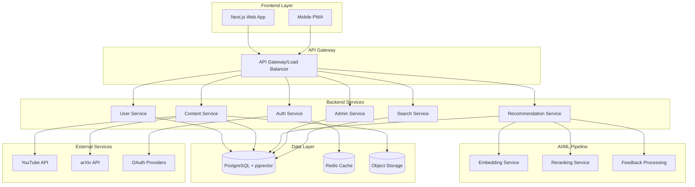

# Design Document

## Overview

HeadStart is designed as a modern, scalable AI-powered learning recommendation platform using a microservices architecture. The system leverages Next.js for the frontend, FastAPI for the backend services, PostgreSQL with pgvector for data storage, and Redis for caching and session management. The platform implements a sophisticated recommendation engine using embeddings and reranking algorithms while maintaining strict security and accessibility standards.

## Architecture

### High-Level Architecture



### Technology Stack

- **Frontend**: Next.js 14+ with TypeScript, Tailwind CSS, React Query
- **Backend**: FastAPI with Python 3.11+, Pydantic for validation
- **Database**: PostgreSQL 15+ with pgvector extension
- **Cache**: Redis 7+ for sessions and caching
- **Storage**: AWS S3 or compatible object storage
- **Queue**: Celery with Redis broker for background tasks
- **Search**: PostgreSQL full-text search with pgvector semantic search
- **Auth**: OAuth2 PKCE, JWT tokens, Argon2id password hashing
- **Deployment**: Docker containers, Kubernetes orchestration

## Components and Interfaces

### Frontend Components

#### User Interface Components
- **AuthenticationFlow**: Login/register forms with OAuth integration
- **UserDashboard**: Personal learning analytics and progress tracking
- **RecommendationFeed**: Personalized content recommendations with explanations
- **ContentViewer**: Unified viewer for different content types
- **SearchInterface**: Semantic search with filters and faceted navigation
- **ProfileManager**: User preferences and goal configuration

#### Admin Interface Components
- **AdminDashboard**: Platform analytics and system health monitoring
- **ContentModerator**: Content review, approval, and curation tools
- **UserManager**: User account management and support tools
- **SystemConfig**: Platform configuration and feature toggles

### Backend Services

#### Authentication Service (`/api/auth/*`)
```python
# Core endpoints
POST /api/auth/register
POST /api/auth/login
POST /api/auth/refresh
POST /api/auth/logout
GET /api/auth/profile
PUT /api/auth/profile
```

#### User Service (`/api/user/*`)
```python
# User management endpoints
GET /api/user/dashboard
GET /api/user/preferences
PUT /api/user/preferences
GET /api/user/progress
POST /api/user/feedback
```

#### Content Service (`/api/content/*`)
```python
# Content management endpoints
GET /api/content/search
GET /api/content/{content_id}
POST /api/content/upload
GET /api/content/sources
```

#### Recommendation Service (`/api/recommendations/*`)
```python
# Recommendation endpoints
GET /api/recommendations/feed
POST /api/recommendations/feedback
GET /api/recommendations/explain/{rec_id}
POST /api/recommendations/refresh
```

#### Admin Service (`/api/admin/*`)
```python
# Admin-only endpoints with RBAC
GET /api/admin/content/pending
PUT /api/admin/content/{id}/approve
GET /api/admin/users
GET /api/admin/analytics
PUT /api/admin/system/config
```

## Data Models

### Core Database Schema

```sql
-- Users table
CREATE TABLE users (
    id UUID PRIMARY KEY DEFAULT gen_random_uuid(),
    email VARCHAR(255) UNIQUE NOT NULL,
    password_hash VARCHAR(255), -- NULL for OAuth-only users
    full_name VARCHAR(255) NOT NULL,
    role VARCHAR(50) DEFAULT 'learner',
    is_active BOOLEAN DEFAULT true,
    email_verified BOOLEAN DEFAULT false,
    created_at TIMESTAMP DEFAULT NOW(),
    updated_at TIMESTAMP DEFAULT NOW()
);

-- User preferences and goals
CREATE TABLE user_preferences (
    id UUID PRIMARY KEY DEFAULT gen_random_uuid(),
    user_id UUID REFERENCES users(id) ON DELETE CASCADE,
    learning_domains TEXT[], -- Array of domains like 'AI', 'Web Dev'
    skill_levels JSONB, -- {"AI": "beginner", "Python": "intermediate"}
    preferred_content_types TEXT[], -- ['video', 'article', 'paper']
    time_constraints JSONB, -- {"max_duration": 30, "sessions_per_week": 3}
    language_preferences TEXT[] DEFAULT ARRAY['en'],
    created_at TIMESTAMP DEFAULT NOW(),
    updated_at TIMESTAMP DEFAULT NOW()
);

-- Content items
CREATE TABLE content_items (
    id UUID PRIMARY KEY DEFAULT gen_random_uuid(),
    title VARCHAR(500) NOT NULL,
    description TEXT,
    content_type VARCHAR(50) NOT NULL, -- 'video', 'article', 'paper', 'course'
    source VARCHAR(100) NOT NULL, -- 'youtube', 'arxiv', 'upload'
    source_id VARCHAR(255), -- External ID from source
    url VARCHAR(1000),
    duration_minutes INTEGER,
    difficulty_level VARCHAR(20), -- 'beginner', 'intermediate', 'advanced'
    topics TEXT[], -- Array of topic tags
    language VARCHAR(10) DEFAULT 'en',
    metadata JSONB, -- Source-specific metadata
    embedding vector(1536), -- OpenAI embedding dimension
    status VARCHAR(20) DEFAULT 'pending', -- 'pending', 'approved', 'rejected'
    created_at TIMESTAMP DEFAULT NOW(),
    updated_at TIMESTAMP DEFAULT NOW()
);

-- User interactions and feedback
CREATE TABLE user_interactions (
    id UUID PRIMARY KEY DEFAULT gen_random_uuid(),
    user_id UUID REFERENCES users(id) ON DELETE CASCADE,
    content_id UUID REFERENCES content_items(id) ON DELETE CASCADE,
    interaction_type VARCHAR(50) NOT NULL, -- 'view', 'like', 'dislike', 'complete', 'bookmark'
    rating INTEGER CHECK (rating >= 1 AND rating <= 5),
    feedback_text TEXT,
    time_spent_minutes INTEGER,
    completion_percentage FLOAT DEFAULT 0,
    created_at TIMESTAMP DEFAULT NOW()
);

-- Recommendations log
CREATE TABLE recommendations (
    id UUID PRIMARY KEY DEFAULT gen_random_uuid(),
    user_id UUID REFERENCES users(id) ON DELETE CASCADE,
    content_id UUID REFERENCES content_items(id) ON DELETE CASCADE,
    recommendation_score FLOAT NOT NULL,
    explanation_factors JSONB, -- Factors that influenced the recommendation
    algorithm_version VARCHAR(50),
    shown_at TIMESTAMP DEFAULT NOW(),
    clicked_at TIMESTAMP,
    feedback_rating INTEGER
);

-- Learning sessions
CREATE TABLE learning_sessions (
    id UUID PRIMARY KEY DEFAULT gen_random_uuid(),
    user_id UUID REFERENCES users(id) ON DELETE CASCADE,
    content_id UUID REFERENCES content_items(id) ON DELETE CASCADE,
    started_at TIMESTAMP DEFAULT NOW(),
    ended_at TIMESTAMP,
    progress_percentage FLOAT DEFAULT 0,
    notes TEXT
);
```

### Embedding and Vector Search

```sql
-- Enable pgvector extension
CREATE EXTENSION IF NOT EXISTS vector;

-- Create vector similarity index
CREATE INDEX content_embedding_idx ON content_items 
USING ivfflat (embedding vector_cosine_ops) WITH (lists = 100);

-- Example similarity search query
SELECT c.*, 1 - (c.embedding <=> query_embedding) as similarity_score
FROM content_items c
WHERE c.status = 'approved'
ORDER BY c.embedding <=> query_embedding
LIMIT 20;
```

## Error Handling

### Centralized Error Management

```python
# Custom exception classes
class HeadStartException(Exception):
    def __init__(self, message: str, error_code: str, status_code: int = 500):
        self.message = message
        self.error_code = error_code
        self.status_code = status_code

class ValidationError(HeadStartException):
    def __init__(self, message: str):
        super().__init__(message, "VALIDATION_ERROR", 400)

class AuthenticationError(HeadStartException):
    def __init__(self, message: str = "Authentication required"):
        super().__init__(message, "AUTH_ERROR", 401)

class AuthorizationError(HeadStartException):
    def __init__(self, message: str = "Insufficient permissions"):
        super().__init__(message, "AUTHZ_ERROR", 403)

# Global error handler
@app.exception_handler(HeadStartException)
async def headstart_exception_handler(request: Request, exc: HeadStartException):
    logger.error(f"HeadStart error: {exc.error_code} - {exc.message}", 
                extra={"request_id": request.state.request_id})
    
    return JSONResponse(
        status_code=exc.status_code,
        content={
            "error": {
                "code": exc.error_code,
                "message": exc.message,
                "request_id": request.state.request_id
            }
        }
    )
```

### Input Validation and Sanitization

```python
# Pydantic models for request validation
class UserPreferencesUpdate(BaseModel):
    learning_domains: List[str] = Field(..., max_items=10)
    skill_levels: Dict[str, str] = Field(..., max_items=20)
    preferred_content_types: List[str] = Field(..., max_items=5)
    time_constraints: Dict[str, Union[int, float]] = Field(default_factory=dict)
    
    @validator('learning_domains')
    def validate_domains(cls, v):
        allowed_domains = ['AI', 'Web Development', 'Data Science', 'Mobile Development']
        for domain in v:
            if domain not in allowed_domains:
                raise ValueError(f'Invalid learning domain: {domain}')
        return v

# Input sanitization utility
def sanitize_search_query(query: str) -> str:
    # Remove potentially dangerous characters
    sanitized = re.sub(r'[<>"\']', '', query)
    # Limit length
    return sanitized[:200]
```

## Testing Strategy

### Unit Testing
- **Backend**: pytest with fixtures for database and external service mocking
- **Frontend**: Jest and React Testing Library for component testing
- **Coverage Target**: 80% minimum for new code, 70% overall

### Integration Testing
- **API Testing**: httpx with pytest for endpoint testing
- **Database Testing**: Test database with realistic data fixtures
- **External Service Testing**: Mock external APIs (YouTube, arXiv, OAuth)

### End-to-End Testing
- **Framework**: Playwright for cross-browser testing
- **Critical Flows**: 
  - User registration and onboarding
  - Recommendation generation and feedback
  - Content search and discovery
  - Admin content moderation
- **Accessibility Testing**: axe-core integration for WCAG compliance

### Performance Testing
- **Load Testing**: Artillery.js for API load testing
- **Database Performance**: Query optimization and index effectiveness
- **Frontend Performance**: Lighthouse CI for Core Web Vitals

### Security Testing
- **SAST**: Bandit for Python, ESLint security rules for JavaScript
- **DAST**: OWASP ZAP for runtime security scanning
- **Dependency Scanning**: Dependabot and Snyk for vulnerability detection
- **Penetration Testing**: Quarterly third-party security assessments

## Security Implementation

### Authentication and Authorization
```python
# JWT token configuration
JWT_ALGORITHM = "HS256"
JWT_ACCESS_TOKEN_EXPIRE_MINUTES = 15
JWT_REFRESH_TOKEN_EXPIRE_DAYS = 7

# Password hashing with Argon2id
from passlib.context import CryptContext
pwd_context = CryptContext(schemes=["argon2"], deprecated="auto")

# RBAC middleware
async def require_role(required_role: str):
    def decorator(func):
        async def wrapper(request: Request, current_user: User = Depends(get_current_user)):
            if current_user.role != required_role and current_user.role != 'admin':
                raise AuthorizationError()
            return await func(request, current_user)
        return wrapper
    return decorator
```

### Content Security Policy
```python
# Security headers middleware
@app.middleware("http")
async def add_security_headers(request: Request, call_next):
    response = await call_next(request)
    response.headers["Content-Security-Policy"] = (
        "default-src 'self'; "
        "script-src 'self' 'unsafe-inline' https://apis.google.com; "
        "style-src 'self' 'unsafe-inline' https://fonts.googleapis.com; "
        "img-src 'self' data: https:; "
        "connect-src 'self' https://api.openai.com;"
    )
    response.headers["X-Frame-Options"] = "DENY"
    response.headers["X-Content-Type-Options"] = "nosniff"
    return response
```

## Deployment and Infrastructure

### Docker Configuration
```dockerfile
# Multi-stage build for production optimization
FROM node:18-alpine AS frontend-builder
WORKDIR /app
COPY src/package*.json ./
RUN npm ci --only=production
COPY src/ .
RUN npm run build

FROM python:3.11-slim AS backend
WORKDIR /app
COPY requirements.txt .
RUN pip install --no-cache-dir -r requirements.txt
COPY . .
EXPOSE 8000
CMD ["uvicorn", "main:app", "--host", "0.0.0.0", "--port", "8000"]
```

### Kubernetes Deployment
```yaml
apiVersion: apps/v1
kind: Deployment
metadata:
  name: headstart-api
spec:
  replicas: 3
  selector:
    matchLabels:
      app: headstart-api
  template:
    metadata:
      labels:
        app: headstart-api
    spec:
      containers:
      - name: api
        image: headstart/api:latest
        ports:
        - containerPort: 8000
        env:
        - name: DATABASE_URL
          valueFrom:
            secretKeyRef:
              name: headstart-secrets
              key: database-url
        resources:
          requests:
            memory: "256Mi"
            cpu: "250m"
          limits:
            memory: "512Mi"
            cpu: "500m"
```

This design provides a robust, scalable foundation for the HeadStart learning recommendation platform while maintaining security, performance, and maintainability standards outlined in the Kiro rules.