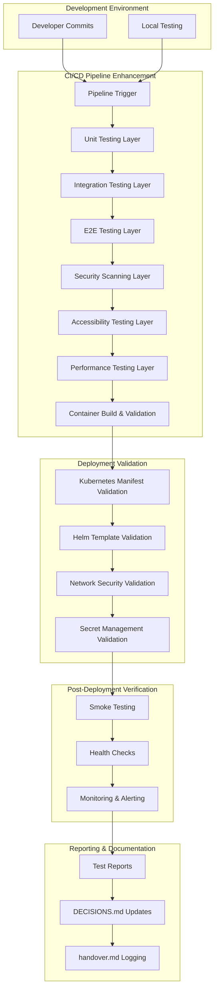
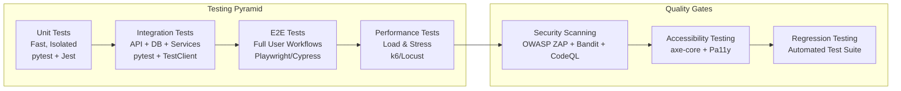

# Design Document

## Overview

The Testing and Deployment Validation system is designed as a comprehensive quality assurance and deployment readiness platform that integrates with the existing HeadStart AI-Powered Learning Recommendation Platform. The system extends the current CI/CD pipeline with enhanced testing layers, security validation, accessibility compliance, and deployment verification capabilities.

The design leverages the existing Docker-based architecture, GitHub Actions CI/CD pipeline, and multi-service setup (FastAPI backend, Next.js frontend, PostgreSQL, Redis, Celery) while adding robust testing orchestration, security scanning, and deployment validation components.

## Architecture

### High-Level Architecture



### Testing Architecture Layers



## Components and Interfaces

### 1. Test Orchestration Engine

**Purpose**: Coordinates execution of all testing layers and manages test dependencies.

**Key Components**:
- `TestOrchestrator`: Main coordination class
- `TestRunner`: Executes individual test suites
- `TestReporter`: Aggregates and formats test results
- `QualityGateValidator`: Enforces quality thresholds

**Interfaces**:
```python
class TestOrchestrator:
    async def execute_test_pipeline(self, context: TestContext) -> TestResults
    async def validate_quality_gates(self, results: TestResults) -> bool
    async def generate_reports(self, results: TestResults) -> ReportSummary

class TestRunner:
    async def run_unit_tests(self) -> UnitTestResults
    async def run_integration_tests(self) -> IntegrationTestResults
    async def run_e2e_tests(self) -> E2ETestResults
    async def run_performance_tests(self) -> PerformanceTestResults
```

### 2. Security Validation Engine

**Purpose**: Comprehensive security scanning and vulnerability assessment.

**Key Components**:
- `SecurityScanner`: Orchestrates security tools
- `VulnerabilityAnalyzer`: Analyzes scan results
- `ComplianceChecker`: Validates security compliance
- `SecretValidator`: Ensures no hardcoded secrets

**Interfaces**:
```python
class SecurityScanner:
    async def run_static_analysis(self) -> StaticAnalysisResults
    async def run_dependency_scan(self) -> DependencyResults
    async def run_container_scan(self) -> ContainerScanResults
    async def validate_secrets_management(self) -> SecretsValidationResults

class VulnerabilityAnalyzer:
    def analyze_severity(self, vulnerabilities: List[Vulnerability]) -> SeverityReport
    def generate_remediation_plan(self, vulnerabilities: List[Vulnerability]) -> RemediationPlan
```

### 3. Accessibility Compliance Engine

**Purpose**: Ensures WCAG compliance and accessibility standards.

**Key Components**:
- `AccessibilityTester`: Runs accessibility scans
- `WCAGValidator`: Validates WCAG compliance levels
- `AccessibilityReporter`: Generates accessibility reports

**Interfaces**:
```python
class AccessibilityTester:
    async def run_axe_scan(self, urls: List[str]) -> AxeResults
    async def run_pa11y_scan(self, urls: List[str]) -> Pa11yResults
    async def validate_wcag_compliance(self, level: str = "AA") -> ComplianceResults
```

### 4. Deployment Validation Engine

**Purpose**: Validates deployment configurations and infrastructure readiness.

**Key Components**:
- `KubernetesValidator`: Validates K8s manifests
- `HelmValidator`: Validates Helm charts
- `NetworkSecurityValidator`: Validates network policies
- `ConfigurationValidator`: Validates environment configs

**Interfaces**:
```python
class DeploymentValidator:
    async def validate_kubernetes_manifests(self) -> KubernetesValidationResults
    async def validate_helm_templates(self) -> HelmValidationResults
    async def validate_network_security(self) -> NetworkSecurityResults
    async def validate_environment_config(self) -> ConfigValidationResults
```

### 5. Post-Deployment Verification Engine

**Purpose**: Validates system functionality after deployment.

**Key Components**:
- `SmokeTestRunner`: Executes critical path tests
- `HealthCheckValidator`: Validates service health
- `MonitoringSetup`: Configures monitoring and alerting

**Interfaces**:
```python
class PostDeploymentValidator:
    async def run_smoke_tests(self) -> SmokeTestResults
    async def validate_health_endpoints(self) -> HealthCheckResults
    async def verify_critical_workflows(self) -> WorkflowValidationResults
    async def setup_monitoring(self) -> MonitoringSetupResults
```

## Data Models

### Test Context and Results Models

```python
@dataclass
class TestContext:
    branch: str
    commit_sha: str
    environment: str
    test_config: TestConfiguration
    deployment_target: str

@dataclass
class TestResults:
    unit_tests: UnitTestResults
    integration_tests: IntegrationTestResults
    e2e_tests: E2ETestResults
    security_scan: SecurityScanResults
    accessibility_test: AccessibilityResults
    performance_test: PerformanceResults
    overall_status: TestStatus
    quality_gate_passed: bool

@dataclass
class UnitTestResults:
    total_tests: int
    passed_tests: int
    failed_tests: int
    coverage_percentage: float
    execution_time: float
    test_files: List[TestFileResult]

@dataclass
class SecurityScanResults:
    vulnerabilities: List[Vulnerability]
    severity_counts: Dict[str, int]
    compliance_status: ComplianceStatus
    remediation_required: bool
    scan_tools_used: List[str]

@dataclass
class DeploymentValidationResults:
    kubernetes_validation: KubernetesValidationResults
    helm_validation: HelmValidationResults
    network_security: NetworkSecurityResults
    secrets_validation: SecretsValidationResults
    deployment_ready: bool
```

### Configuration Models

```python
@dataclass
class TestConfiguration:
    unit_test_config: UnitTestConfig
    integration_test_config: IntegrationTestConfig
    e2e_test_config: E2ETestConfig
    security_scan_config: SecurityScanConfig
    accessibility_config: AccessibilityConfig
    performance_test_config: PerformanceTestConfig

@dataclass
class QualityGateThresholds:
    min_unit_test_coverage: float = 80.0
    min_integration_test_coverage: float = 70.0
    max_critical_vulnerabilities: int = 0
    max_high_vulnerabilities: int = 5
    max_accessibility_violations: int = 0
    max_performance_regression: float = 10.0
```

## Error Handling

### Error Classification and Response Strategy

```python
class TestingError(Exception):
    """Base exception for testing system errors"""
    pass

class QualityGateFailure(TestingError):
    """Raised when quality gates fail"""
    def __init__(self, failed_gates: List[str], details: Dict):
        self.failed_gates = failed_gates
        self.details = details

class SecurityViolation(TestingError):
    """Raised when security scans find critical issues"""
    def __init__(self, vulnerabilities: List[Vulnerability]):
        self.vulnerabilities = vulnerabilities

class DeploymentValidationError(TestingError):
    """Raised when deployment validation fails"""
    def __init__(self, validation_failures: List[ValidationFailure]):
        self.validation_failures = validation_failures
```

### Error Recovery and Retry Logic

- **Transient Failures**: Automatic retry with exponential backoff
- **Infrastructure Failures**: Fallback to alternative testing environments
- **Quality Gate Failures**: Block deployment with detailed remediation guidance
- **Security Violations**: Immediate pipeline halt with security team notification

## Testing Strategy

### 1. Unit Testing Enhancement

**Backend (Python)**:
- Extend existing pytest setup with additional test categories
- Add property-based testing with Hypothesis
- Implement mutation testing for test quality validation
- Add async testing patterns for Celery tasks

**Frontend (TypeScript/React)**:
- Enhance Jest configuration with additional matchers
- Add React Testing Library best practices
- Implement visual regression testing with Chromatic
- Add component interaction testing

### 2. Integration Testing Framework

**API Integration Tests**:
- Test complete API workflows with real database
- Validate service-to-service communication
- Test authentication and authorization flows
- Validate data consistency across services

**Database Integration Tests**:
- Test database migrations and rollbacks
- Validate complex queries and performance
- Test data integrity constraints
- Validate backup and recovery procedures

### 3. End-to-End Testing Implementation

**User Journey Testing**:
- Complete user registration and onboarding
- Learning recommendation workflows
- Admin content management workflows
- Multi-user collaboration scenarios

**Cross-Browser Testing**:
- Chrome, Firefox, Safari, Edge compatibility
- Mobile responsive design validation
- Progressive Web App functionality
- Offline capability testing

### 4. Performance Testing Framework

**Load Testing Scenarios**:
- Normal user load simulation
- Peak traffic simulation
- Stress testing beyond capacity
- Endurance testing for memory leaks

**Performance Metrics**:
- Response time percentiles (P50, P95, P99)
- Throughput measurements
- Resource utilization monitoring
- Database performance metrics

### 5. Security Testing Implementation

**Static Analysis**:
- Code vulnerability scanning with Bandit
- Dependency vulnerability scanning with Safety
- Infrastructure as Code scanning
- Secret detection in codebase

**Dynamic Analysis**:
- OWASP ZAP automated scanning
- API security testing
- Authentication bypass testing
- Input validation testing

### 6. Accessibility Testing Framework

**Automated Testing**:
- axe-core integration for WCAG validation
- Pa11y command-line testing
- Color contrast validation
- Keyboard navigation testing

**Manual Testing Guidelines**:
- Screen reader compatibility
- Voice navigation support
- Motor impairment accessibility
- Cognitive accessibility features

## Deployment Validation Strategy

### 1. Container Validation

**Build Validation**:
- Multi-stage build optimization
- Security scanning of base images
- Dependency vulnerability assessment
- Image size optimization validation

**Runtime Validation**:
- Container startup health checks
- Resource limit validation
- Security context validation
- Network connectivity testing

### 2. Kubernetes Manifest Validation

**Manifest Linting**:
- kubectl dry-run validation
- Resource quota compliance
- Security policy validation
- Best practices enforcement

**Deployment Strategy Validation**:
- Rolling update configuration
- Readiness and liveness probes
- Resource requests and limits
- Pod disruption budgets

### 3. Network Security Validation

**Network Policy Validation**:
- Least-privilege network access
- Service mesh configuration
- Ingress controller security
- TLS certificate validation

**Security Context Validation**:
- Pod security standards
- Service account permissions
- RBAC configuration
- Secret management validation

## Monitoring and Alerting

### 1. Test Execution Monitoring

**Real-time Dashboards**:
- Test execution progress
- Quality gate status
- Performance metrics
- Error rate monitoring

**Alerting Rules**:
- Quality gate failures
- Security vulnerability detection
- Performance regression alerts
- Deployment validation failures

### 2. Post-Deployment Monitoring

**Health Check Monitoring**:
- Service availability monitoring
- Database connectivity checks
- External service dependency checks
- Performance baseline monitoring

**Business Logic Monitoring**:
- Critical user workflow success rates
- Recommendation engine performance
- Content processing pipeline health
- User authentication success rates

## Integration Points

### 1. Existing CI/CD Pipeline Integration

The system extends the existing `.github/workflows/ci.yml` pipeline by:
- Adding new job dependencies and quality gates
- Integrating with existing test infrastructure
- Enhancing security scanning capabilities
- Adding deployment validation steps

### 2. Docker and Container Integration

Leverages existing Docker setup:
- Extends `Dockerfile.backend` and `Dockerfile.frontend` with security scanning
- Integrates with `docker-compose.yml` for local testing
- Adds container security validation
- Implements multi-stage build optimization

### 3. Database and Service Integration

Works with existing service architecture:
- Integrates with PostgreSQL and Redis services
- Validates Celery task processing
- Tests service-to-service communication
- Validates data consistency and integrity

### 4. Frontend and Backend Integration

Coordinates testing across the full stack:
- Validates API contract compliance
- Tests frontend-backend integration
- Validates authentication flows
- Tests real-time communication features